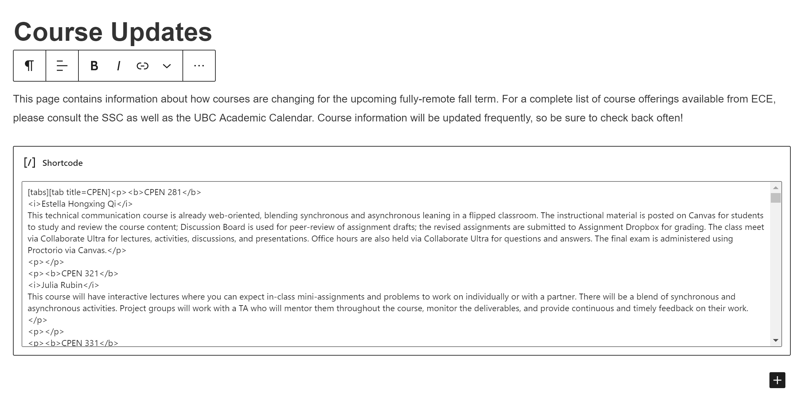

# sheet2shortcode

Generating formatted shortcode for WordPress from a Google Sheet.

## Installation

- Java
- Gradle
- *(Recommended)* VS Code, with the relevant Java extensions, including Checkstyle for Java
- A Google `credentials.json` file in `src/main/resources`

## Usage

Run `gradle run` to produce an output.

This project uses Google's Checks for linting. In VS Code, right-click on the `src/` folder and click "check files" to see linting warnings and/or errors.

Auto check must be enabled in your VS Code settings.

Here's an example of the output.

## Road map

- Add more extensibility for other (csv) file structures.
- Write unit tests
